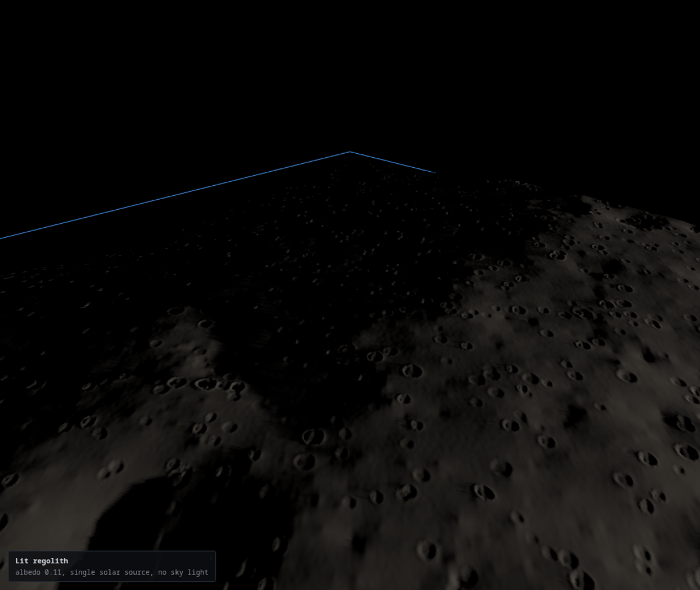
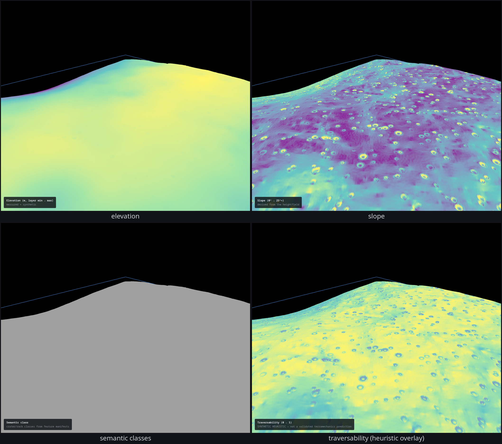
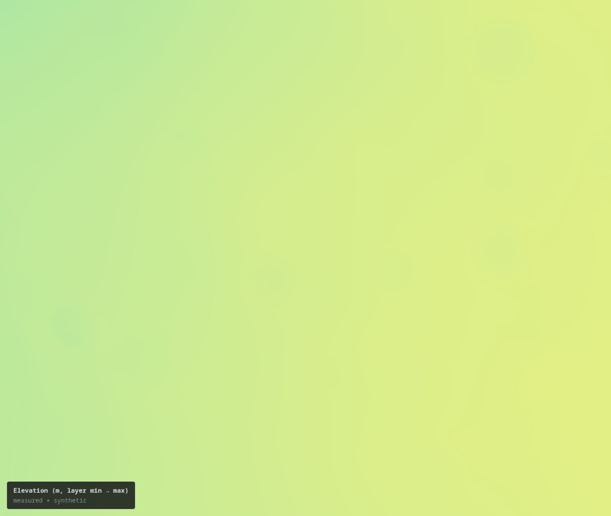
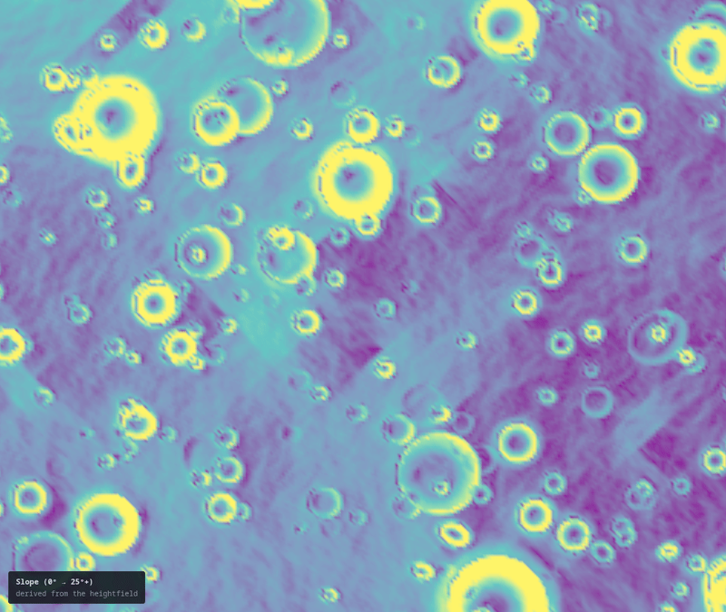
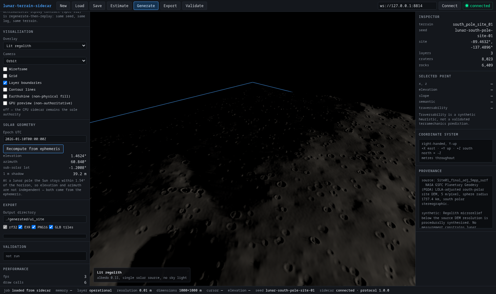

# lunar-terrain-sidecar

Terrain generation, authoring and preprocessing sidecar for a Godot-based lunar
robotics simulation, focused on the **lunar south pole** with a real solar
ephemeris.

It is not the physics engine. It produces terrain; Godot remains the simulation
authority.



```
Godot Simulation
      │  WebSocket / JSON-RPC 2.0  (ws://127.0.0.1:8768)
      ▼
Terrain Sidecar Server
      ├── terrain-core        seeding, noise, tiling, feasibility
      ├── lunar-solar         ephemeris, sub-solar point, horizon, PSR
      ├── lunar-dem           real LOLA / PGDA DEM ingestion
      ├── lunar-features      craters (Neukum/Xiao–Werner), rocks (Golombek)
      ├── terrain-pipeline    the generation pipeline
      ├── terrain-export      rf32 / EXR / PNG16 / npy / GLB / JSON
      └── terrain-validation  26 automated checks
              ▼
      Heightmaps / Tiles / Manifests
              ▼
         Godot Importer  (godot/addon/lunar_terrain)
```

## Why the sun is not a slider

At a lunar pole the Sun never rises more than **1.54°** above the horizon,
because the Moon's spin axis is tilted only 1.5424° to the ecliptic. Shadow
length goes as `1/tan(elevation)`, so a 1 m rock throws a **38 m** shadow and a
crater rim shadows its floor permanently. Illumination there is a property of
*topography and date*, not a lighting preference — so elevation and azimuth are
computed from a real ephemeris, never set independently.


```
$ npm run terrain -- solar -89.4631639 -137.4895528 2026-08-03T00:00:00Z

solar elevation      -0.45772°
solar azimuth        80.58135°   (clockwise from north, north = -Z)
sub-solar point      0.54555°, -56.90356°
disc above horizon   0.0%
```

See [`docs/decisions/0001-solar-model.md`](docs/decisions/0001-solar-model.md).

## Real data, not invented terrain

Elevations come from real LOLA products; synthesis happens **only below what the
measurement resolves**, so the two never double-count:

| Layer | Source | Provenance recorded |
|---|---|---|
| context / mission / operational | PGDA 5 m/px polar site DEM (Site01, Haworth, Shoemaker, …) | `measured_dem_plus_synthetic_subresolution` |
| craters below 17.5 m | Neukum production capped by Xiao & Werner equilibrium | `production_csfd` |
| boulders | Golombek exponential SFD | instance manifest |
| centimetre microrelief | procedural | flagged as a synthetic heuristic |

Every export carries a per-sample `elevation_source.r8` mask recording which
elevations are measurement and which are synthesis. If a configured DEM is
missing, generation **fails** rather than substituting invented elevations.

## Getting the data

The kernels and DEMs are public NASA products, not vendored in the repo:

```bash
bash scripts/fetch-data.sh          # downloads to ./data, verifies SHA-256
export LTS_SPICE_DIR="$PWD/data/spice_kernels"
```

The script fetches the JPL DE440 kernels (NAIF) and the PGDA/LOLA 5 m/px
Site01 DEM (~87 MB total), verifies every checksum against the copies this
repository was validated with, and prints the config/env lines that point the
tools at the downloads. `LTS_SPICE_DIR` overrides the default kernel
directory; DEM paths live in each site config (`dem.path`).

The CLI runs through `tsx` (Node ≥ 20 required): `npm run terrain -- <cmd>`.
The `bin` entry in package.json points at the TypeScript source and is only
runnable where `tsx` is installed; there is no compiled standalone binary.

## Quick start

```bash
pnpm install    # or: npm install

# What will this cost before it allocates anything?
npm run terrain -- estimate examples/south_pole_site_01/config.json

# Generate a three-tier south-polar site from real LOLA data
npm run terrain -- generate examples/south_pole_site_01/config.json

# 26 automated checks over the exported artifacts
npm run terrain -- validate examples/south_pole_site_01/generated/south_pole_site_01

# Regenerate and compare every checksum
npm run terrain -- reproduce examples/south_pole_site_01/config.json

# Start the Godot sidecar
npm run serve

# Interactive authoring UI (needs the sidecar running)
npm run ui          # then open http://localhost:5173
```

Connecting the UI to a sidecar that already holds terrain renders it
immediately — no Generate needed. If the lit view is black, read the banner:
the Sun really is below the horizon at that epoch (it spends much of each
month there), and the viewport says so rather than looking broken.

## What it looks like

All images are real renders of real data — headless Chromium over the live
sidecar, terrain from the real LOLA Site01 DEM, lighting from the ephemeris.
Provenance and regeneration commands: [`docs/media/README.md`](docs/media/README.md).









## Godot editor addon

Copy `godot/addon/lunar_terrain` into your project's `addons/`, enable
**Lunar Terrain Sidecar** in Project Settings → Plugins, and a dock appears with
a connection indicator, configuration picker, seed field, Generate / Regenerate
/ Import, live progress, the artifact list with stale-file detection, validation
results, and the declared coordinate system.

The addon speaks the same JSON-RPC protocol as the browser UI
(`sidecar_client.gd`), so the editor can drive generation directly and import
the artifacts the sidecar writes.

```
LunarTerrainRoot
├── ContextTerrain / MissionTerrain / OperationalTerrain   MeshInstance3D
├── TerrainCollision                                       StaticBody3D
│   └── non-overlapping HeightMapShape3D per tier
├── PhysicalRocks / VisualRocks                            MultiMeshInstance3D
└── TerrainMetadata                                        seed, frame, provenance
```

## Measured results

All numbers below were produced by the commands in this README on this machine
(AMD64, Node 20.20.2, Godot 4.6.3-stable), not estimated.

**Demonstration site** — `examples/south_pole_site_01`, anchored at
89.463°S 137.490°W on the real `Site01` PGDA DEM:

| | |
|---|---|
| layers | 1 km @ 2 m, 200 m @ 0.2 m, 30 m @ 0.01 m |
| samples | 10,259,003 |
| craters / rocks | 8,023 / 6,409 |
| artifacts | 183 files, 625.9 MB |
| generate / export | 3.4 s / 1.8 s (8 worker threads, byte-identical to single-thread) |
| validation | 26 checks, 0 errors |
| reproducibility | **183/183 artifacts byte-identical** |

Rock count and timing rose from the first release: the Golombek rim-excess fix
stopped dividing the calibrated background density by 4, so the same k = 0.05
now realises ~4.6× more rocks (which is the point — the old figure understated
the cited model). Timings are one sample on one machine; `npm run bench:terrain`
produces the full measured table (`benchmarks/`).

**Godot round trip** (`tests/godot-roundtrip.test.ts`, 145 probe points across
all three tiers, raycast against real collision geometry):

| | |
|---|---|
| probes missed | 0 |
| max elevation error, on-grid | **9.0e-6 m** |
| max elevation error, off-grid | 1.0e-2 m (bilinear vs Godot's triangulation) |
| addon loader read error | 2.22e-16 m |
| collision normals | all `normal_y > 0` (winding correct) |

**Godot addon lifecycle** (`tests/godot-integration.test.ts`, all 21 steps of
spec §26 against a live sidecar in headless Godot):

| | |
|---|---|
| elevation agreement through collision | **6e-6 m** |
| cut/fill balance on a mass-conserving edit | **0.000%** |
| excavation 0.40 m | 0.1039 m → −0.2961 m |
| collision surface after reload | −0.2961 m — followed exactly |
| editor dock | builds 24 controls, all required actions present |

**Test suite**: 257 tests across 15 files. Suites gated on local data,
kernels, or a Godot binary **skip loudly** when those are absent — a fresh
clone without datasets runs the dataset-free majority and reports the rest
as skipped, never as fake passes.

```bash
npm test                        # full suite (vitest)
bash scripts/fetch-data.sh      # fetch public datasets + kernels, then:
export LTS_SITE01_DEM=...       #   enables DEM-gated suites (UI, Godot,
export LTS_LDEM_75S=...         #   provenance, parallel, far-horizon)
export LTS_SPICE_DIR=...        #   enables the DE440 suites
```

The Godot suites additionally need a Godot 4 editor binary on `LTS_GODOT`
or PATH. See [CONTRIBUTING.md](CONTRIBUTING.md) for the development
workflow.

```
tests/lunar-solar.ephemeris.test.ts   23   ephemeris vs physical invariants
tests/lunar-solar.de.test.ts          12   TS DE440 reader vs frozen JPL reference
tests/lunar-dem.real-data.test.ts     19   real LOLA products vs GDAL
tests/lunar-features.test.ts          47   crater/rock models, RNG, estimator
tests/terramech.test.ts               19   Bekker-Wong vs hand-derived formulas
tests/protocol.test.ts                21   real WebSocket JSON-RPC server
tests/construction.test.ts            20   spec-11 features, volumes, mass balance
tests/history.test.ts                 16   operation log + deterministic replay
tests/sync.test.ts                     7   sparse deltas + snapshot/restore
tests/parallel.test.ts                 4   worker-thread byte-identity
tests/provenance.test.ts               4   per-sample provenance + solar labels
tests/godot-roundtrip.test.ts         10   headless Godot collision agreement
tests/godot-integration.test.ts        9   full spec-26 addon lifecycle + dock
tests/interactive-ui.test.ts          35   real Chromium + WebGL, screenshots
tests/far-horizon.test.ts             11   far-field horizon ring (ADR 0006)
```

## Coordinates

**Right-handed, Y-up, +X east, +Z south — north is −Z.**

The spec asked for right-handed *and* Z=north, which cannot both hold: with
X=east and Y=up, right-handedness forces `Z = X × Y = south`. Handedness was
kept because it governs winding, normals and physics chirality, and because
Three.js and Godot are both right-handed. North is carried as **data** in every
manifest so no consumer has to guess. See
[`docs/decisions/0002-coordinate-handedness.md`](docs/decisions/0002-coordinate-handedness.md).

Grid `col` increases east; `row` increases south, so **row 0 is northernmost**.
Azimuth is clockwise from north: `(x, z) = (sin A, −cos A)`.

## What is synthetic, and labelled as such

Per the project's absolute rule, nothing here fabricates data that stands in for
measurement. Three outputs are genuinely synthetic and say so in every manifest:

- **Centimetre microrelief.** No measurement constrains lunar roughness at
  centimetre scale at these sites. Plausible texture, not observed topography.
- **Traversability** now defaults to a static Bekker–Wong assessment (sinkage,
  drawbar-pull slope margin) with parameters from the NASA LTV terramechanics
  white paper (NTRS 20220010732), cross-checked against Mitchell et al. (1972)
  Apollo in-situ ranges. Still labeled: parameters are equatorial/simulant-
  derived — no polar site has in-situ measurements — and the model is static
  assessment, not force-accurate dynamics (docs/decisions/0005-terramechanics.md).
  The original hand-weighted heuristic remains available and labeled.
- **Sub-DEM crater and boulder populations.** Statistically anchored to
  published size-frequency distributions, but individual features are sampled,
  not observed.

## Known limitations

- **Solar accuracy is now measured, not estimated.** A dependency-free
  TypeScript reader for the real JPL DE440 kernels (SPK + binary PCK lunar
  orientation, on-disk at `/mnt/projects/datasets/spice_kernels`) provides an
  `ephemeris_de` mode and measures the default Meeus/IAU chain against JPL's
  integrated truth: **max 0.0111° sub-solar separation over 2020–2049** (reproducible: `npm run terrain -- de-compare --months 360`; a denser dev-time sweep measured 0.0118°) — the
  literature's 0.01–0.03° budget holds at its favourable end. The default mode
  stays analytic to preserve byte-reproducibility of existing sites; see
  docs/decisions/0004-de440-kernels.md.
- **PSR determination needs 18.6 years of sampling**, not one year, because the
  sub-solar latitude envelope migrates with the nodal cycle.
  `illuminationStatistics` reports the span it was given; it does not assert a
  PSR from a short sample.
- **Skyline fidelity is bounded by the widest layer by default; an opt-in
  far-field ring lifts the bound for queries.** `terrain.getHorizon` with
  `farField: true` great-circle-marches the real LOLA LDEM_75S 120 m/px
  product to 100 km and merges it by per-bin max (the Mazarico et al. 2011
  reference method; docs/decisions/0006-far-field-horizon.md). Distant relief
  can only raise a horizon, so the near-field-only default errs bright — and
  the *rendered* viewport shadows still use layer geometry alone either way.
- **The browser viewport is a decimated preview.** Layers are streamed at a
  stride that bounds each to ~512 samples per edge (a 3001² operational layer
  is 36 MB of float32). Anything a user might act on — elevation, slope,
  semantic class, traversability — is queried from the sidecar, which holds the
  full-resolution field. Do not read measurements off the mesh.
- **Undo is an inverse operation, not a snapshot.** It re-applies the opposite
  edit. For `raise`/`lower`/`berm`/`trench` that is exact; for `smooth` and
  `flatten`, which are not invertible, undo will not restore the prior surface.
- **Off-grid elevation agreement is ~1 cm**, because Godot triangulates each
  heightfield cell into two flat triangles while the sidecar interpolates
  bilinearly. On-grid agreement is 9 µm.
- **GPU and WASM acceleration are not implemented.** CPU generation is the
  reference implementation and the only implementation.
- **Rock count estimates are background expectations** — rim-excess rocks are
  added on top per crater (realised counts ran ~2.2× the background on the
  shipped demo) and slope rejection subtracts; both depend on terrain not yet
  generated.

## Citing

If you use this software, please cite it via [`CITATION.cff`](CITATION.cff)
(Storey, McCardle & Imtiaz, *lunar-terrain-sidecar*, v0.1.2, MIT). A JOSS software paper
draft is in [`paper/paper.md`](paper/paper.md). Please also credit the data:
LOLA (Smith et al. 2010), the PGDA polar DEMs (Barker et al. 2021), and JPL
DE440 (Park et al. 2021).

## Layout

```
packages/   shared-types terrain-core lunar-solar lunar-dem
            lunar-features terrain-pipeline terrain-export
            terrain-validation terrain-protocol
apps/       headless-server (CLI + JSON-RPC sidecar)
            interactive-ui  (Three.js authoring UI)
godot/      addon/lunar_terrain (loader, sidecar client, editor dock, plugin)
            example-project     (round-trip + integration harnesses)
examples/   south_pole_site_01
docs/       decisions/
tests/      257 tests across 15 files
```
